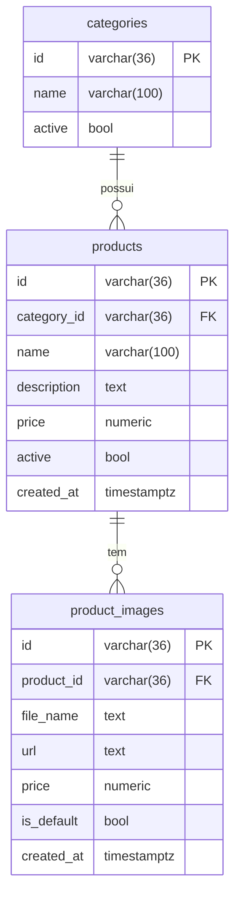

# API Microservice Catalog

## Estrutura do Projeto

Este repositório contém dois principais diretórios:

- **infra/**: scripts e módulos de infraestrutura como código (IaC) para provisionamento de recursos na AWS, incluindo banco de dados, rede, ECS, ALB, entre outros.
- **microservice/**: código-fonte do microsserviço de catálogo, responsável pelo gerenciamento de produtos e categorias.

---

## infra/

A pasta `infra` utiliza Terraform para provisionar toda a infraestrutura necessária na AWS. Entre os recursos provisionados estão:

- **Banco de Dados (RDS/Postgres):**
  - O banco de dados é criado via módulo e seu endpoint é passado como variável de ambiente para o container do microsserviço no ECS.
  - O RDS garante alta disponibilidade, backups automáticos e segurança de dados.
- **ECS (Elastic Container Service):**
  - O microsserviço é executado em containers gerenciados pelo ECS, garantindo escalabilidade e fácil deploy.
- **ALB (Application Load Balancer):**
  - Gerencia o tráfego HTTP/HTTPS para o serviço, incluindo health checks.
- **Variáveis de ambiente:**
  - O endpoint do banco de dados, usuário, senha e outras configurações são passadas via variáveis de ambiente para o container.

---

## microservice/

O diretório `microservice` contém o código do microsserviço de catálogo, desenvolvido em Go, seguindo arquitetura limpa (clean architecture).

### Banco de Dados
- Utiliza Postgres, tanto localmente (via Docker) quanto na AWS (RDS).
- As configurações de conexão (host, porta, usuário, senha, nome do banco) são lidas de variáveis de ambiente, permitindo fácil portabilidade entre ambientes.

### Modelagem das Tabelas

#### Categoria
- `id` (varchar(36), PK)
- `name` varchar(100)
- `active` bool

#### Produto
- `id` (varchar(36), PK)
- `category_id` (varchar(36), FK para Categoria)
- `name` (varchar(100))
- `description` (text)
- `price` (numeric)
- `active` (bool)
- `created_at` (timestamptz)

#### Imagens do Produto
- `id` (varchar(36), PK)
- `product_id` (varchar(36), FK para Produto)
- `file_name` (text)
- `url` (text)
- `is_default` (bool)
- `created_at` (timestamptz)

## Diagrama de Entidade-Relacionamento (Mermaid)



### Justificativa para Modelagem Relacional
- **Relacionamento entre produtos e categorias:** Cada produto pertence a uma categoria, o que exige integridade referencial e facilita consultas relacionais (ex: listar todos os produtos de uma categoria).
- **Transações e consistência:** O modelo relacional permite transações ACID, garantindo consistência dos dados em operações críticas.
- **Facilidade de manutenção:** A modelagem relacional facilita alterações futuras, como adição de novos relacionamentos ou entidades.
- **Validação de integridade:** O uso de chaves estrangeiras impede a existência de produtos sem categoria válida.

### Outros Pontos
- O microsserviço está preparado para rodar tanto localmente quanto na AWS, bastando ajustar as variáveis de ambiente.
- O código segue boas práticas de separação de camadas, facilitando manutenção e testes.

---

## Rotas Disponíveis

### Categorias
| Método | Rota                        | Descrição                    |
|--------|-----------------------------|------------------------------|
| POST   | /v1/categories              | Cadastrar nova categoria     |
| GET    | /v1/categories              | Listar todas as categorias   |
| GET    | /v1/categories/:id          | Buscar categoria por ID      |
| PUT    | /v1/categories/:id          | Atualizar categoria          |
| DELETE | /v1/categories/:id          | Remover categoria            |

### Produtos
| Método | Rota                                         | Descrição                        |
|--------|----------------------------------------------|----------------------------------|
| POST   | /v1/products                                | Cadastrar novo produto           |
| GET    | /v1/products                                | Listar todos os produtos (retorna apenas imagem default) |
| GET    | /v1/products?category_id={id}               | Listar produtos por categoria (retorna apenas imagem default) |
| GET    | /v1/products/:id                            | Buscar produto por ID            |
| PUT    | /v1/products/:id                            | Atualizar produto                |
| DELETE | /v1/products/:id                            | Remover produto                  |
| PATCH  | /v1/products/:id/images                     | Adicionar imagem ao produto      |
| DELETE | /v1/products/:id/images/:image_file_name     | Remover imagem do produto        |
| GET    | /v1/products/:id/images                     | Listar todas as imagens do produto |

### Outros
| Método | Rota                 | Descrição                  |
|--------|----------------------|----------------------------|
| GET    | /health              | Health check               |
| GET    | /v1/health           | Health check v1            |
| GET    | /swagger/index.html  | Documentação Swagger       |

---

## Checklist de Testes das Rotas da API

## Categorias
| Rota                                      | Método | Disponível para testes | Observações                       |
|-------------------------------------------|--------|----------|-----------------------------------|
| /v1/categories                           | POST   | ✅      | Cadastrar nova categoria          |
| /v1/categories                           | GET    | ✅      | Listar todas as categorias        |
| /v1/categories/:id                       | GET    | ✅      | Buscar categoria por ID           |
| /v1/categories/:id                       | PUT    | ✅      | Atualizar categoria               |
| /v1/categories/:id                       | DELETE | ✅      | Remove categoria (apenas se não houver produtos relacionados; não tem cascade) |

## Produtos
| Rota                                      | Método | Testado? | Observações                       |
|-------------------------------------------|--------|----------|-----------------------------------|
| /v1/products                             | POST   | ✅      | Cadastrar novo produto            |
| /v1/products                             | GET    | ✅      | Listar todos os produtos (retorna apenas imagem default) |
| /v1/products?category_id={id}            | GET    | ✅      | Listar produtos por categoria (retorna apenas imagem default) |
| /v1/products/:id                         | GET    | ✅      | Buscar produto por ID (retorna apenas imagem default) |
| /v1/products/:id                         | PUT    | ✅      | Atualizar produto                 |
| /v1/products/:id                         | DELETE | ✅      | Remover produto (cascade: deleta imagens do banco e do bucket, exceto a default_product_image.webp) |
| /v1/products/:id/images                  | PATCH  | ✅      | Adicionar imagem ao produto (nova imagem fica com a flag is_default como True e todas as anteriores são setadas como false) |
| /v1/products/:id/images/:image_file_name | DELETE | ✅      | Remove imagem do produto: se não for default, remove do banco e do bucket (exceto default_product_image.webp); se for default e houver outras, a mais recente vira default; se for a única imagem, deleção é barrada. |
| /v1/products/:id/images                  | GET    | [ ]      | Listar todas as imagens do produto |

## Outros
| Rota                                      | Método | Testado? | Observações                       |
|-------------------------------------------|--------|----------|-----------------------------------|
| /health                                  | GET    | [ ]      |                                   |
| /v1/health                               | GET    | [ ]      |                                   |
| /swagger/index.html                      | GET    | [ ]      | Verificar documentação            |

---

**Observações Gerais:**
- Teste com dados válidos e inválidos.
- Verifique respostas de erro (400, 404, 500).
- Teste upload e remoção de imagens.
- Teste filtro por categoria.
- Anote problemas, melhorias ou comportamentos inesperados.

---

## Como rodar localmente

1. Suba os serviços necessários com Docker Compose:
   ```sh
   docker compose up --build
   ```
2. Exporte as variáveis de ambiente conforme o exemplo do `.env`.
3. Execute o microsserviço normalmente.

---

## Como configurar variáveis de ambiente para MinIO (local) ou AWS S3

O projeto já possui dois arquivos de exemplo para configuração das variáveis de ambiente:
- `.env.local.example`: para rodar localmente com MinIO simulando o S3
- `.env.aws.example`: para rodar apontando diretamente para a AWS S3

**Como usar:**
1. Escolha o arquivo de exemplo conforme o ambiente desejado.
2. Copie e renomeie para `.env.local` ou `.env.aws` (por exemplo: `cp .env.local.example .env.local` ou `cp .env.aws.example .env.aws`).
3. No arquivo `docker-compose.yaml`, altere o campo `env_file` do serviço `api` para referenciar o arquivo desejado:
   ```yaml
   env_file:
     - .env.local   # para MinIO
     # ou
     - .env.aws     # para AWS S3
   ```
4. Ajuste os valores das variáveis conforme necessário (bucket, credenciais, endpoint, etc).

**Resumo das principais variáveis:**
- Para MinIO local:
  - `API_UPLOAD_URL=http://minio:9000`
  - `AWS_S3_ENDPOINT=http://minio:9000`
- Para AWS S3:
  - `API_UPLOAD_URL=https://<nome-do-bucket>.s3.<região>.amazonaws.com`
  - `AWS_S3_ENDPOINT=` (deixe vazio)

**Sobre as credenciais:**
- **MinIO local:**
  - As variáveis `AWS_ACCESS_KEY_ID` e `AWS_SECRET_ACCESS_KEY` devem ser preenchidas com o usuário e senha do MinIO (geralmente definidos como `MINIO_ROOT_USER` e `MINIO_ROOT_PASSWORD` no seu .env).
- **AWS S3:**
  - As variáveis `AWS_ACCESS_KEY_ID` e `AWS_SECRET_ACCESS_KEY` devem ser preenchidas com as credenciais de um usuário IAM da AWS que tenha permissão de acesso ao bucket S3 utilizado.

Assim, basta ajustar as credenciais conforme o ambiente desejado para garantir o funcionamento correto do upload e acesso às imagens.

Assim, basta trocar o arquivo de variáveis e o serviço irá apontar para o ambiente desejado.

---

## Imagem Default para Produtos (Minio)

Se estiver rodando localmente com Minio, é necessário subir manualmente a imagem default do produto para o bucket. Essa imagem é usada quando um produto não possui imagem cadastrada.

1. Certifique-se de que o serviço Minio está rodando.
2. Acesse o painel do Minio (geralmente em http://localhost:9000) ou utilize o client Minio.
3. Utilize o usuário e senha definido no seu arquivo .env nas variáveis MINIO_ROOT_USER e MINIO_ROOT_PASSWORD para acessar o Minio
2. Crie o bucket com o nome definido no seu arquivo .env na variável **AWS_S3_BUCKET_NAME**

3. Faça upload do arquivo que está na pasta `uploads/default_product_image.webp` para o bucket que foi criado anteriormente.

Assim, sempre que um produto não tiver imagem, o sistema irá retornar a imagem default.

---

## Observações
- Para produção, garanta que as variáveis de ambiente estejam corretas e nunca sobrescreva o host do banco para `localhost` no código.
- O seed de dados deve ser executado apenas em ambiente controlado, pois insere dados iniciais no banco.
