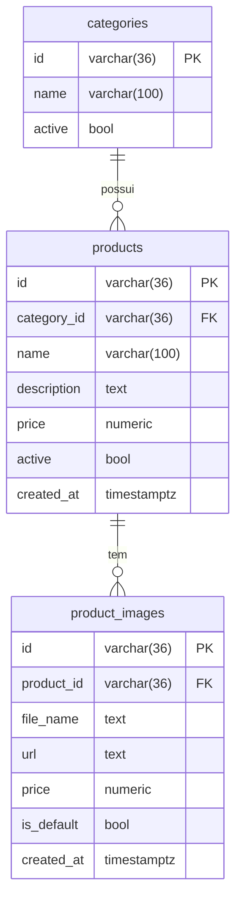

# API Microservice Catalog

Este microsserviço tem como objetivo central o cadastro e a gestão de produtos e categorias, permitindo operações completas de criação, atualização, consulta e remoção, além do gerenciamento de imagens de produtos. Ele foi projetado para garantir integridade relacional, escalabilidade e facilidade de integração com outros sistemas do ecossistema.

## Pré-requisitos
- [Docker](https://www.docker.com/)
- [Docker Compose](https://docs.docker.com/compose/)
- [Go](https://golang.org/) (para desenvolvimento local)
- [Terraform](https://www.terraform.io/) (para provisionamento de infraestrutura)
- [AWS CLI](https://aws.amazon.com/cli/) (para integração com AWS)

## Estrutura do Projeto

Este repositório contém dois principais diretórios:

- **infra/**: scripts e módulos de infraestrutura como código (IaC) para provisionamento de recursos na AWS, rede, ECS, bucket S3, entre outros.
- **microservice/**: código-fonte do microsserviço de catálogo, responsável pelo gerenciamento de produtos e categorias.

---

## Estrutura de Pastas
- `microservice/` - Código-fonte do microsserviço (API, domínio, infraestrutura, etc)
- `infra/` - Scripts e módulos Terraform para provisionamento de recursos na AWS
- `uploads/` - Imagens default e arquivos de upload

## Variáveis de Ambiente
Principais variáveis utilizadas (veja exemplos completos em `.env.local.example` e `.env.aws.example`):
- `API_UPLOAD_URL` - URL base para uploads de imagens (MinIO ou AWS S3)
- `AWS_S3_BUCKET_NAME` - Nome do bucket S3
- `AWS_ACCESS_KEY_ID` / `AWS_SECRET_ACCESS_KEY` - Credenciais AWS ou MinIO
- `AWS_REGION` - Região AWS
- `DB_HOST`, `DB_NAME`, `DB_PORT`, `DB_USERNAME`, `DB_PASSWORD` - Configurações do banco de dados

## infra/

A pasta `infra` utiliza Terraform para provisionar toda a infraestrutura necessária na AWS. Entre os recursos provisionados estão:

- **ECS (Elastic Container Service):**
  - O microsserviço é executado em containers gerenciados pelo ECS, garantindo escalabilidade e fácil deploy.
- **ALB (Application Load Balancer):**
  - Gerencia o tráfego HTTP/HTTPS para o serviço, incluindo health checks.
- **Variáveis de ambiente:**
  - O endpoint do banco de dados, usuário, senha e outras configurações são passadas via variáveis de ambiente para o container.

---

## microservice/

O diretório `microservice` contém o código do microsserviço de catálogo, desenvolvido em Go, seguindo arquitetura limpa (clean architecture).

### Banco de Dados
- Utiliza Postgres, tanto localmente (via Docker) quanto na AWS (RDS).
- As configurações de conexão (host, porta, usuário, senha, nome do banco) são lidas de variáveis de ambiente, permitindo fácil portabilidade entre ambientes.

### Modelagem das Tabelas

#### Categoria
- `id` (varchar(36), PK)
- `name` varchar(100)
- `active` bool

#### Produto
- `id` (varchar(36), PK)
- `category_id` (varchar(36), FK para Categoria)
- `name` (varchar(100))
- `description` (text)
- `price` (numeric)
- `active` (bool)
- `created_at` (timestamptz)

#### Imagens do Produto
- `id` (varchar(36), PK)
- `product_id` (varchar(36), FK para Produto)
- `file_name` (text)
- `url` (text)
- `is_default` (bool)
- `created_at` (timestamptz)

## Diagrama de Entidade-Relacionamento (Mermaid)



### Justificativa para Modelagem Relacional
- **Relacionamento entre produtos e categorias:** Cada produto pertence a uma categoria, o que exige integridade referencial e facilita consultas relacionais (ex: listar todos os produtos de uma categoria).
- **Transações e consistência:** O modelo relacional permite transações ACID, garantindo consistência dos dados em operações críticas.
- **Facilidade de manutenção:** A modelagem relacional facilita alterações futuras, como adição de novos relacionamentos ou entidades.
- **Validação de integridade:** O uso de chaves estrangeiras impede a existência de produtos sem categoria válida.

### Outros Pontos
- O microsserviço está preparado para rodar tanto localmente quanto na AWS, bastando ajustar as variáveis de ambiente.
- O código segue boas práticas de separação de camadas, facilitando manutenção e testes.

---

## Rotas Disponíveis


## Categorias
| Rota                                      | Método | Observações                       |
|-------------------------------------------|--------|-----------------------------------|
| /v1/categories                           | POST   | Cadastrar nova categoria          |
| /v1/categories                           | GET    | Listar todas as categorias        |
| /v1/categories/:id                       | GET    | Buscar categoria por ID           |
| /v1/categories/:id                       | PUT    | Atualizar categoria               |
| /v1/categories/:id                       | DELETE | Remove categoria (apenas se não houver produtos relacionados; não tem cascade) |

## Produtos
| Rota                                      | Método | Observações                       |
|-------------------------------------------|--------|-----------------------------------|
| /v1/products                             | POST   | Cadastrar novo produto            |
| /v1/products                             | GET    | Listar todos os produtos (Para cada produto, é retornada apenas a imagem marcada como default.) |
| /v1/products?category_id={id}            | GET    | Listar produtos por categoria (Para cada produto, é retornada apenas a imagem marcada como default.) |
| /v1/products/:id                         | GET    | Buscar produto por ID (Para cada produto, é retornada apenas a imagem marcada como default.) |
| /v1/products/:id                         | PUT    | Atualizar produto                 |
| /v1/products/:id                         | DELETE | Remover produto (cascade: deleta imagens do banco e do bucket, exceto a default_product_image.webp) |
| /v1/products/:id/images                  | PATCH  | Adicionar imagem ao produto (nova imagem fica com a flag is_default como True e todas as anteriores são setadas como false) |
| /v1/products/:id/images/:image_file_name | DELETE | Remove imagem do produto: se não for default, remove do banco e do bucket (exceto default_product_image.webp); se for default e houver outras, a mais recente vira default; se for a única imagem, deleção é barrada. |
| /v1/products/:id/images                  | GET    | Listar todas as imagens do produto |

---

## Como rodar localmente

1. Suba os serviços necessários com Docker Compose:
   ```sh
   docker compose up --build
   ```
2. Exporte as variáveis de ambiente conforme o exemplo do `.env`.
3. Execute o microsserviço normalmente.

---

## Como configurar variáveis de ambiente para MinIO (local) ou AWS S3

O projeto já possui dois arquivos de exemplo para configuração das variáveis de ambiente:
- `.env.local.example`: para rodar localmente com MinIO simulando o S3
- `.env.aws.example`: para rodar apontando diretamente para a AWS S3

**Como usar:**
1. Escolha o arquivo de exemplo conforme o ambiente desejado.
2. Copie e renomeie para `.env.local` ou `.env.aws` (por exemplo: `cp .env.local.example .env.local` ou `cp .env.aws.example .env.aws`).
3. No arquivo `docker-compose.yaml`, altere o campo `env_file` do serviço `api` para referenciar o arquivo desejado:
   ```yaml
   env_file:
     - .env.local   # para MinIO
     # ou
     - .env.aws     # para AWS S3
   ```
4. Ajuste os valores das variáveis conforme necessário (bucket, credenciais, endpoint, etc).

**Resumo das principais variáveis:**
- Para MinIO local:
  - `API_UPLOAD_URL=http://minio:9000`
  - `AWS_S3_ENDPOINT=http://minio:9000`
- Para AWS S3:
  - `API_UPLOAD_URL=https://<nome-do-bucket>.s3.<região>.amazonaws.com`
  - `AWS_S3_ENDPOINT=` (deixe vazio)

**Sobre as credenciais:**
- **MinIO local:**
  - As variáveis `AWS_ACCESS_KEY_ID` e `AWS_SECRET_ACCESS_KEY` devem ser preenchidas com o usuário e senha do MinIO (geralmente definidos como `MINIO_ROOT_USER` e `MINIO_ROOT_PASSWORD` no seu .env).
- **AWS S3:**
  - As variáveis `AWS_ACCESS_KEY_ID` e `AWS_SECRET_ACCESS_KEY` devem ser preenchidas com as credenciais de um usuário IAM da AWS que tenha permissão de acesso ao bucket S3 utilizado.

Assim, basta trocar o arquivo de variáveis e o serviço irá apontar para o ambiente desejado.

---

## Imagem Default para Produtos (Minio e AWS)

Se estiver rodando localmente com Minio, é necessário criar manualmente o bucket e subir a imagem default do produto. Essa imagem é usada sempre que um produto não possui imagem cadastrada.

1. Certifique-se de que o serviço Minio está rodando.
2. Acesse o painel do Minio (geralmente em http://localhost:9000) ou utilize o client Minio.
3. Utilize o usuário e senha definidos no seu arquivo .env nas variáveis MINIO_ROOT_USER e MINIO_ROOT_PASSWORD para acessar o Minio.
4. Crie o bucket com o nome definido no seu arquivo .env na variável **AWS_S3_BUCKET_NAME** (caso ainda não exista).
5. Faça upload do arquivo que está na pasta `uploads/default_product_image.webp` para o bucket criado anteriormente.

Assim, sempre que um produto não tiver imagem, o sistema irá retornar a imagem default.

**Importante:**
- Quando o deploy é realizado via esteira (CI/CD), o bucket `${AWS_S3_BUCKET_NAME}` é provisionado automaticamente e a imagem default (`default_product_image.webp`) já é inserida no bucket durante o provisionamento. Ou seja, **não é necessário realizar nenhum procedimento manual** para garantir a presença da imagem default no bucket em ambientes provisionados pela esteira.
- Esse processo garante que tanto em ambiente local (Minio) quanto em produção (AWS S3), a imagem default estará sempre disponível para os produtos que não possuem imagem cadastrada.

---

## Deploy na AWS

Para realizar o deploy do microsserviço na AWS, basta executar o workflow:

- **Deploy Application to ECS**
  - Esse workflow provisiona toda a infraestrutura necessária (ECS, ALB, variáveis de ambiente, etc) e faz o deploy do container na AWS.

Para remover/destruir a aplicação da AWS, execute o workflow:

- **Destroy Application from ECS**
  - Esse workflow remove todos os recursos provisionados (serviço ECS, ALB, etc) e faz o cleanup do ambiente na AWS.

Esses workflows podem ser executados diretamente pela interface do GitHub Actions ou pela sua esteira CI/CD, facilitando o gerenciamento do ciclo de vida da aplicação em produção.

---

## Exemplos de uso das rotas
Exemplo para criar uma categoria:
```sh
curl -X POST http://localhost:8080/v1/categories \
  -H 'Content-Type: application/json' \
  -d '{"name": "Bebidas", "active": true}'
```
Exemplo para criar um produto:
```sh
curl -X POST http://localhost:8080/v1/products \
  -H 'Content-Type: application/json' \
  -d '{"name": "Coca-Cola", "category_id": "<id>", "price": 5.99, "active": true}'
```

## Como rodar testes unitários localmente e visualizar cobertura de código

Para rodar os testes unitários do microsserviço e visualizar a cobertura de código:

1. Certifique-se de estar na raiz do módulo Go (onde está o arquivo `go.mod`).
2. Execute os testes e gere o relatório de cobertura:
   ```sh
   go test -coverprofile=coverage.out ./...
   ```
3. Para visualizar a cobertura de código em formato HTML (colorido):
   ```sh
   go tool cover -html=coverage.out
   ```
   Isso abrirá uma página no navegador mostrando, linha a linha, o que está coberto por testes (verde = coberto, vermelho = não coberto).

> **Dica:**
> - Se aparecer erro de dependências, rode `go mod tidy` antes de rodar os testes.
> - Para aumentar a cobertura, crie arquivos `*_test.go` nos pacotes desejados.